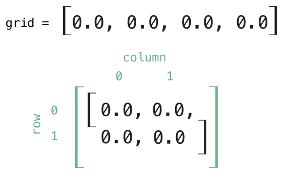
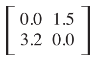

# 下标操作

类、结构体和枚举类型都可以定义下标操作。下标操作是用来访问集合、列表或者序列的元素的简便方法。我们可以通过下标操作来存取它们的值，而不是调用方法。例如通过`someArray[index]`的方式访问`Array`对象的元素或者使用`someDictionary[key]`的形式访问`Dictionary`的值。

我们可以为单个类型定义多个下标操作。我们还可以根据需要定义多维的下标操作。

### 语法
下标操作是我们可以用方括号来访问对象中的属性。它们的写法与实例方法和计算属性类似。通过`subscript`关键字定义下标，需要指明输入参数与返回值类型。我们可以为下标操作定义`getter`或`setter`。
```go
subscript(index: Int) -> Int {
	get {
    	//返回下标对应的值
    }
    
    set {newValue) {
    	//设置下标对应的值	
    }
}
```

`newValue`的类型与返回值类型相同。与计算属性类似，我们可以省略`newValue`参数，Swift默认会提供一个叫`newValue`的参数给`setter`。

同样，对于`getter`来说也可以像计算属性一样省略只读下标的`get`关键字。
```go
subscript(index: Int) -> Int {
	//返回下标对应的值
}
```

下面是一个只读下标的实现，它定义了一个`TimesTable`结构体来表示整数的n倍：
```go
struct TimesTable {
	let multiplier: Int
    subscript(index: Int) -> Int {
    	return multiplier * index
    }
}

let threeTimesTable = TimesTable(multiplier: 3)
println("six times three is \(threeTimesTable[6]")
//prints "six times three is 18"
```

上面的例子创建了一个`TimesTable`实例，表示整数的3倍。我们显式的给它的初始化方法传递了一个参数3作为`multiplier`的值。

通过`threeTimesTable`实例来调用它的下标`threeTimesTable[6]`，结果为3 * 6 = 18。
> **提示**
> 由于这个n倍表是基于一个固定的数学规则，因此不能将`threeTimesTable[someIndex]`设置为一个新的值。我们将`TimesTable`的下标定义为只读。

### 用法
下标的含义取决于它所在的上下文。下标操作一般用于简化集合、列表或序列中元素的访问。我们也可以给自己的类和结构体实现合适的下标操作。

Swift的`Dictionary`类型实现了通过下标存取字典元素的功能。我们通过字典的键（key）来获取和设置它对应的值。
```go
var numberOfLegs = ["spider": 8, "ant": 6, "cat":, 4]
numberOfLegs["bird"] = 2
```

上面的代码定义了一个叫`numberOfLegs`的变量，并且将其初始化为一个字典，推导出它的类型为`Dictionary<String, Int>`。创建好这个字典后，使用下标的赋值操作可以为它添加一个`String`类型的键"bird"以及`Int`类型的值2.

更多关于`Dictionary`的下标操作请查看“访问和修改字典”。
> **提示**
> Swift的`Dictionary`类型实现的键值对下标操作的是一个选项类的值。`numberOfLegs`中获取的值为`Int?`类型。它这样做的目的是为了处理没有值对应的键的情况，以及可以通过将值设为`nil`来删除键值对。

### 选项
下标可以接受任意数目的输入值，这些值可以是任意类型。它同样可以返回任意类型的值。下标操作可以接受变量作为参数以及可变参数，但是不能接受输入输出参数以及默认参数。

我们可以给类和结构体提供任意数目的下标操作。Swift会根据方括号中参数的类型推导出合适的下标操作。定一个多个下标操作称为`下标重载`。

通常情况下，下标操作只能接受一个参数，但是我们可以定义能够接受多个参数的下标操作。下面定义了一个表示二维矩阵的结构体`Matrix`，它的下标能够接受两个整型参数：
```go
struct Matrix {
    let rows: Int, columns: Int
    var grid: Double[]
    init(rows: Int, columns: Int) {
        self.rows = rows
        self.columns = columns
        grid = Array(count: rows * columns, repeatedValue: 0.0)
    }
    func indexIsValidForRow(row: Int, column: Int) -> Bool {
        return row >= 0 && row < rows && column >= 0 && column < columns
    }
    subscript(row: Int, column: Int) -> Double {
        get {
            assert(indexIsValidForRow(row, column: column), "Index out of range")
            return grid[(row * columns) + column]
        }
        set {
            assert(indexIsValidForRow(row, column: column), "Index out of range")
            grid[(row * columns) + column] = newValue
        }
    }
}
```

`Matrix`提供了可以接受两个参数`rows`和`columns`的初始化方法。它能够创建一个可以存储`rows * columns`个`Double`类型数据的数组。数组中的元素倍初始化为0.0。关于数组的初始化可以查看“创建和初始化数组”。
```go
var matrix = Matrix(rows: 2, columns: 2)
```

上面的代码创建了一个拥有2行2列的矩阵对象。其中`Matrix`的`grid`数组是矩阵的一维形式：


我们通过使用矩阵的行列做为下标来访问元素：
```go
matrix[0, 1] = 1.5
matrix[1, 0] = 3.2
```

上面的代码将矩阵右上角值设为1.5，左下角设置为3.2。


在`Matrix`下标操作的`getter`和`setter`中都包含有检查行列值的断言。`Matrix`定义了一个角`indexIsValid`的方法来检查`row`和`column`是否越界：
```go
func indexIsValidForRow(row: Int, column: Int) -> Bool {
	return row >= 0 && row < rows && column >= 0 && column < columns
}
```

如果下标越界，则会触发断言：
```go
let someValue = matrix[2, 2]
//下标越界，触发断言
```