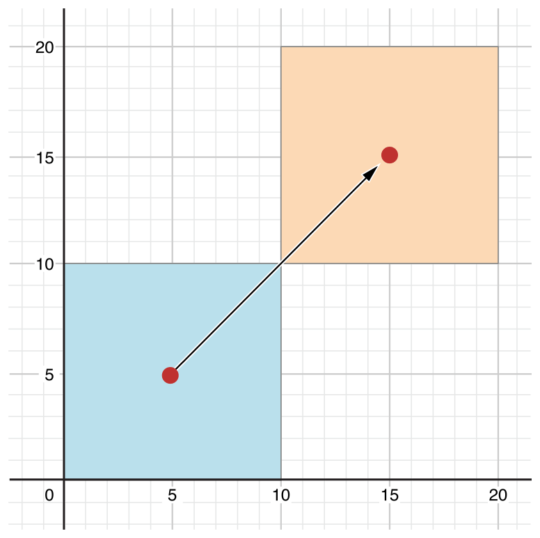

# Swift编程

### 属性

**属性**是依赖于某个特定的类、结构体或者枚举类型的值。Swift有两种属性：存储类型和计算类型。其中存储类型可以作为实例的一部分存放变量或者常量的值，而计算类型的属性值是通过运算的来的。计算类型的属性可以在类、结构体和枚举类型中出现，但存储类型只可能出现在类和结构体类型中。

属性一般依赖于一个特定类型的实例，但是也可以依赖于类本身。依赖于类型本身的属性称为类型属性。

可以定义属性观察者来监督属性值的改变，从而作出响应。

#### 存储属性
常量属性`let`的值在初始化后不能在改变，而变量属性`var`的值可以随时更改。
```go
struct FixedLengthRange {
	var firstValue: Int
    let length: Int
}

var rangeOfThreeItems = FixedLengthRange(firstValue: 0, length: 3)
rangeOfThreeItems.firstValue = 6
```

#### 结构体常量的存储属性
如果一个结构体实例被赋值给一个常量，则这个实例所拥有的存储类型的属性都不能在改变，包括变量属性在内。
```go
let rangeOfFourItems = FixedLengthRange(firstValue: 0, length: 4)
rangeOfFourItems.firstValue = 6
//编译错误，firstValue的值不能改变
```

#### 延时存储属性
**延时存储属性**的初始值直到第一次使用的时候才进行计算，在声明时通过`@lazy`进行标记。
> **提示**
> 一定要将延时存储属性声明为变量（`var`），因为它的初始值可能会在实例初始化完成后才有，而常量属性一般在实例初始化完成之前就会有值。

当属性的初始值依赖于外部银子，并且该因子的值在实例初始化完成之前不确定时，延时属性非常有用。如果属性初始化时需要进行大量的计算，也可以考虑使用延时属性。

下面是延时属性的示例：
```go
class DataImporter {
	/*
    DataImporter是一个从外部文件导入数据的类。假设它需要花费较多的时间进行初始化
    */
    var fileName = "data.txt"
    //DataImporter类的数据导入功能
}

class DataManager {
	@lazy var importer = DataImporter()
    var data = String[]()
    //DataManager类提供数据管理功能
}

let manager = DataManager()
manager.data += "Some data"
manager.data += "Some more data"
//DataImporter实例还没有创建
```

只有访问`DataManager`的`importer`属性时才会去创建这个对象。
```go
println(manager.importer.filename)
//创建importer属性并打印“data.txt"
```

#### 存储属性与实例变量
Objective-C类的对象可以使用属性或者实例变量来存储值。Swift中并没有所谓的实例变量，而是将它们统一为属性了，这样使得属性的声明更加简化。

#### 计算属性
除了存储属性外，类、结构体和枚举类型还可以定义计算属性。这些计算属性并不能够存储值，而是通过`getter`方法和可选的`setter`方法来间接的获取和设置其它属性和值。
```go
struct Point {
	var x = 0.0, y = 0.0
}

struct Size {
	var width = 0.0, height = 0.0
}

struct Rect {
	var origin = Point()
    var size = Size()
    var center: Point {
    	get {
        	let centerX = origin.x + (size.width / 2)
            let centerY = origin.y + (size.height / 2)
            return Point(x: centerX, y: centerY)
        }
        
        set(newCenter) {
        	origin.x = newCenter.x - (size.width / 2)
            origin.y = newCenter.y - (size.height / 2)
        }
    }
}
var square = Rect(origin: Point(x: 0.0, y: 0.0),
					size: Size(width: 10.0, height: 10.0))
let initialSquareCenter = square.center
square.center = Point(x: 15.0, y: 15.0)
println("square.origin is now at (\(square.origin.x), \(square.origin.y))")
//打印”square.origin is now at (10.0, 10.0)“
```

这个例子定义了三个结构体来表示几何形状：
- `Point`封装了(x, y)坐标。
- `Size`封装了宽度和高度。
- `Rect`用坐标原点和大小定义一个矩形。

其中`Rect`结构体还提供了一个`center`的计算属性。这个属性的值是由矩形的`origin`和`size`属性决定的，它本身并不需要存储信息。但是改变`center`的值，会间接的修改矩形的其它属性。


#### 简化`setter`的声明
如果没有为计算属性的`setter`的新值指定名字，则默认使用`newValue`。下面是`Rect`结构体的另外一种写法：
```go
struct AlternativeRect {
	var origin = Point()
    var size = Size()
    var center: Point {
    	get {
        	let centerX = origin.x + (size.width / 2)
            let centerY = origin.y + (size.height / 2)
            
            return Point(x: centerX, y: centerY)
        }
        set {
        	origin.x = newValue.x - (size.width / 2)
            origin.y = newValue.y - (size.height / 2)
        }
    }
}
```

#### 只读的计算属性
如果一个计算属性只有`getter`而没有声明`setter`，则它是一个只读的计算属性。只读属性只能通过点语法返回一个值，而不能对它进行设置。
> **提示**
> 必须使用`var` 声明计算属性，包括只读的计算属性在内，因为它们的值是可能改变的。而`let`只能用于常量的声明，表示它们的值不能发生改变。

还可以省略只读计算属性声明中的`get`关键字。
```go
struct Cuboid {
	var width = 0.0, height = 0.0, depth = 0.0
    var volume: Double {
    	return width * height * depth
    }
}

let fourByFiveByTwo = Cuboid(width: 4.0, height: 5.0, depth: 2.0)
println("the volume of fourByFiveByTwo is \(fourByFiveByTwo.volume)")
//打印“the volume of fourByFiveByTwo is 40.0”
```

#### 属性观察者
属性观察者用来观察和响应属性值的变化。每次设置属性的值都会调用相应的观察者，哪怕是设置相同的值。

可以给除延时存储属性以外的任何存储属性添加观察者。通过重写属性，可以在子类中给父类的属性（包括存储属性和计算属性）添加观察者。
> **提示**
> 不需要给类本身定义的计算属性添加观察者，完全可以在计算属性的`setter`中完成对值的观察。

通过下面两个方法对属性进行观察：
- `willSet`在属性的值发生改变之前调用。
- `didSet`在设置完属性的值后调用。

如果没有给`willSet`指定参数的话，编译器默认提供一个`newValue`做为参数。同样，在`didSet`中如果没有提供参数的话，默认为`oldValue`。
> **提示**
> `willSet`和`didSet`观察者在属性进行初始化的时候不会被调用。

```go
class StepCounter {
	var totalSteps: Int = 0 {
    	willSet(newTotalSteps) {
        	println("About to set totalSteps to \(newTotalSteps)")
        }
        didSet {
        	if totalSteps > oldValue {
            	println("Added \(totalSteps - oldValue) steps")
            }
        }
    }
}

let stepCounter = StepCounter()
stepCounter.totalSteps = 200
//About to set totalSteps to 200
//Added 200 steps
stepCounter.totalSteps = 360
//About to set totalSteps to 360
//Added 160 steps
stepCounter.totalSteps = 896
//About to set totalSteps to 896
//Added 536 steps
```
> **提示**
> 如果在`didSet`中给属性设置新值，最终结果就是最后设置的这个值。

#### 全局变量与局部变量
上面关于计算属性和属性观察对全局变量和局部变量同样成立。全局变量定义在任意的方法、函数、闭包或者类型定义之外。而局部变量则定义在方法、函数或闭包之内。

之前遇到的全局变量或者局部变量都跟存储属性类型，都是用来存储值的。但实际上它们也能像计算属性有计算变量。
> **提示**
> 全局变量和常量与延时属性类似，总是延时进行计算。但是它们并不需要使用`@lazy`标记。
> 局部常量和变量一定不是延时计算的。

#### 类型属性
实例属性属于某个特定类型的实例。每次创建的实例，它都拥有自己的一组独立的属性值，不受其它实例对象影响。

你还可以定义属于类型本身的属性。这些属性是与具体的实例无关的，不管创建多少个实例都只有一份。这种属性称之为**类型属性**。

可以给值类型（结构体和枚举类型）定义存储和计算类型的类属性，但是只能给类定义计算类型的类属性。值类型的存储属性可以是变量或常量。
> **提示**
> 一定要给存储类型的类属性设置初始值。

#### 类型属性语法
在C/Objective-C中只能使用全局静态变量来定义依赖与某个属性的变量或常量。但是在Swift中可以直接将它们定义为类型的一部分。其中结构体和枚举类型中使用`static`关键字，而在类类型中则使用`class`关键字。
```go
struct SomeStructure {
	static var storedTypeProperty = "Some value."
    static var computedTypeProperty: Int {
    	//return an Int value here
    }
}

enum SomeEnumeration {
	static var storedTypeProperty = "Some value."
    static var computedTypeProperty: Int {
    	//return an Int value here
    }
}

class SomeClass {
	class var computedTypeProperty: Int {
    	//return an Int value here
    }
}
```
> **提示**
> 上面的计算属性都是只读的，但实际上可以定义为可读可写

#### 使用类型属性
类型属性通过类型名字和点操作符进行访问和设置，而不是通过实例对象：
```go
println(SomeClass.computedTypeProperty)
//print "42"

println(SomeStructure.storedTypeProperty)
//prints "Some value"
SomeStructure.storedTypeProperty = "Another value."
println(SomeStructure.storedTypeProperty)
//prints "Another value."
```

下面演示了如何使用一个结构体来对声道音量进行建模，其中每个声道音量范围为0-10。

```go
struct AudioChannel {
	static let thresholdLevel = 10
    static var maxInputLevelForAllChannel = 0
    var currentLevel: Int = 0 {
    	didSet {
        	if currentLevel > AudioChannel.thresholdLevel {
            	currentLevel = AudioChannel.thresholdLevel
            }
            
            if currentLevel > AudioChannel.maxInputLevelForAllChannels{
            	AudioChannel.maxInputLevelForAllChannels = currentLevel
        }
    }
}

var leftChannel = AudioChannel()
var rightChannel = AudioChannel()

leftChannel.currentLevel = 7
println(leftChannel.currentLevel)
//prints "7"
println(AudioChannel.maxInputLevelForAllChannels)
//prints "7"
```

当修改其中一个声道的值时，整个声道的音量最大值就可能发生改变。而每个声道都有自己的当前音量水平。
