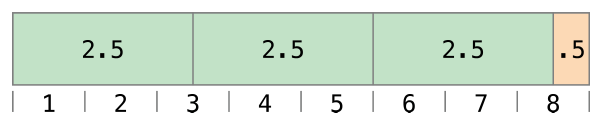

# Swift编程

### 基本操作符
**操作符**是一类特殊的符号，用来检查、更改或者合成某些值。例如加号`+`将两个数值加到一起（`let i = 1 + 1`）。还有更复杂的操作符，如逻辑与`&&`（`if enteredDoorCode && passedRetinScan`）和自增运算符`++i`。

Swift支持大多数标准的标准C操作符以及一些用来减少编码错误的增强。赋值运算`=`不再返回值，这样可以避免将`==`误写为`=`。数学运算符（`+`、`-`、`*`、`/`、`%`等）会进行溢出检测来防止异常发生。并且还可以使用Swift的溢出操作符进行优化。

除此以外，Swift还对求余运算符`%`进行了增强，能作用在浮点数上。Swift还可以使用C语言中没有的范围运算符，如`a..b`和`a...b`。

这章主要描述Swift中的基本操作符，高级操作符在后面再单独介绍。

### 专业术语
Swift的操作符分为一元运算符、二元运算符和三元运算符。
- 一元运算符只能有一个操作数（`-a`），包括前缀式一元运算符（`!b`）和后缀式一元运算符（`i++`）。
- 二元运算符需要两个操作数（`2 + 3`）。
- 三元运算符需要三个操作数，和C语言类似，Swift只有一个三元运算符（`a ? b : c`）。

### 赋值运算符
赋值运算符用来进行初始化或者改变变量的值：
```go
let b = 10
var a = 5
a = b
//a is now equal to 10
```

如果赋值操作的右边是一个有多个值的元组，它的值可以一次性被分开设置给多个常量或者变量。
```go
let (x, y) = (1, 2)
//x = 1, y = 2
```

与C或Objective-C不同的地方是Swift的赋值表达式没有返回值，因此下面的写法是错误的：
```go
if x = y {
	//非法，x=y没有返回值
}
```

### 算术运算符
Swift支持四种标准的算术运算符：
- 加法`+`
- 减法`-`
- 乘法`*`
- 除法`/`

```go
1 + 2	//3
5 - 3 	//2
2 * 3	//6
10.0 / 2.5	//4.0
```

Swift的支持字符串类型`String`的加法运算，起到连接字符串的作用：
```go
"hello, " + "world"	//"hello, world"
```

两个字符类型`Character`相加得到一个字符串`String`：
```go
let dog: Character = "d"
let cow: Character = "o"
let dogCow = dog + cow
//dogCow = do
```

### 求余运算符
求余运算符`a % b`计算`a`被`b`整除后的余数。
> **提示**
> 求余操作符（%）在其它语言里称为取模操作。

计算`9 % 4`的结果，首先计算9里面可以容纳多少个4，然后剩余多少。


```go
9 % 4	//1
```
计算公式为：
`a = (b x 倍数) + 余数`

负数的计算结果为：
`-9 = (4 x -2) + -1`
而第二个操作数的符号会被忽略，因此`a % b`与`a % -b`的结果相同。

### 浮点数求余
Swift中可以对浮点数求余：
```go
8 % 2.5 //0.5
```


