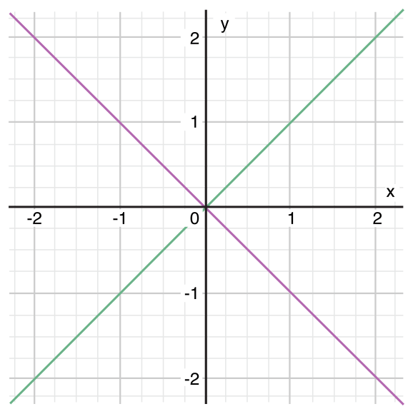

# Swift编程
### 流程控制

Swift提供C语言类似的流程控制结构。它使用`for`和`while`执行重复操作；`if`和`switch`实现分支判断；`break`和`continue`进行跳转。

除了C语言中的`for-condition-increment`循环形式，Swift还提供`for-in`快速循环，使得对数组、字典、范围、字符串或其它的序列结构进行遍历变得更加简单。

Swift的`switch`语句比C语言中更加强大。它不需要使用`break`来结束每个`case`。每个`case`能够匹配更多类型的模式，包括范围、元组等，对于复杂的条件还能使用`where`进行判断，而C语言中只能使用整数。

### `for`循环
`for`循环可以让一组语句执行特定的次数。Swift提供了两种类型的`for`循环：
- `for-in`遍历范围、序列、集合等数据结构。
- `for-condition-increment`执行循环体，直到不满足条件。

#### `for-in` 
`for-in`类型的循环可以对集合中的元素进行遍历，如一组数值、一个数组或者字符串。下面是循环打印五次：
```go
for index in 1...5 {
	println("\(index) times 5 is \(index * 5)")
}
// 1 times 5 is 5
// 2 times 5 is 10
// 3 times 5 is 15
// 4 times 5 is 20
// 5 times 5 is 25
```
> **提示**
> `index`常量的作用域只在循环体里面。如果需要在外面使用它的值，则应该在循环体外面定义一个遍历。

如果不需要从范围中获取值的话，可以使用下划线`_`代替常量`index`的名字，从而忽略这个常量的值：
```go
let base = 3
let power = 10
var answer = 1
for _ in 1...power {
	answer *= base
}
println("\(base) to the power of \(power) is \(answer)")
//prints "3 to the power of 10 is 59049"
```

下面是使用`for-in`遍历数组里的元素：
```go
let names = ["Anna", "Alex", "Brain", "Jack"]
for name in names {
	println("Hello, \(name)!")
}
//Hello, Anna!
//Hello, Alex!
//Hello, Brain!
//Hello, Jack!
```

还可以使用键值对遍历字典：
```go
let numberOfLegs = ["spider": 8, "ant": 6, "cat": 4]
for (animalName, legCount) in numberOfLegs {
	println("\(animalName)s have \(legCount) legs")
}
//spiders have 8 legs
//ants have 6 legs
//cats have 4 legs
```
由于字典是无序的，因此迭代的顺序不一定和插入顺序相同。

对于字符串`String`进行遍历的时候，得到的是里面的字符`Character`：
```go
for character in "Hello" {
	println(character)
}
// H
// e
// l
// l
// o
```

#### `for-condition-increment`
第二种形式的`for`循环与C语言相同，需要一个循环条件和递增的变量：
```go
for var index = 0; index < 3; ++index {
	println("index is \(index)")
}
//index is 0
//index is 1
//index is 2
```

下面是这种循环的通用格式，`for`循环中的分号不能省略：
for `初始化`; `循环条件`; `递增变量` {
	`循环体语句`
}
这些语句的执行顺序如下：
1. 第一次进入是先执行初始化表达式，给循环中用到的常量和变量赋值。
2. 执行循环条件表达式，如果为`false`，循环结束，否则执行花括号`{}`里的循环体语句。
3. 循环体执行完后，递增遍历表达式执行，然后再回到上面的第2条。

这中形式的`for`循环可以用下面的`while`循环等价替换：
```go
初始化
while 循环条件 {
	循环体语句
    递增变量
}
```

在初始化是声明的常量或变量的作用域为`for`循环里面，如果需要在循环结束后使用`index`的值，需要在`for`循环之前进行声明：
```go
var index: Int
for index = 0; index < 3; ++index {
	println("index is \(index)")
}
//index is 0
//index is 1
//index is 2
println("The loop statements were executed \(index) times")
//prints "The loop statements were executed 3 times"
```

### `while`循环
`while`循环也有两种形式：
- `while`在执行循环体之前先判断循环条件。
- `do-while`先执行循环体，然后再判断循环条件。

#### `while`循环
`while`的通用格式：
```go
while 循环条件 {
	循环体语句
}
```

#### `do-while`循环
`do-while`循环的通用格式：
```go
do {
	循环体语句
}while(循环条件)
```

### 条件判断语句
条件判断语句包括`if`和`switch`。

#### `if`语句
最简单的形式就是一个`if`语句，当`if`的判断条件为`true`的时候，执行`if`里面的语句：
```go
var temperatureInFahrenheit = 30
if temperatureInFahrenheit <= 32 {
	println("It's very cold. Consider wearing a scarf.")
}
//prints "It's very cold. Consider wearing a scarf."
```

如果需要在`if`的判断条件为`false`的时候执行一些操作，可以加入`else`语句：
```go
temperatureInFahrenheit = 40
if temperatureInFahrenheit <= 32 {
	println("It's very cold. Consider wearing a scarf.")
}
else {
	println("It's not that cold. Wear a t-shirt.")
}
//prints "It's not that cold. Wear a t-shirt."
```

如果需要增加更多的判断条件，可以将多个`if-else`语句链接起来：
```go
temperatureInFahrenheit = 90
if temperatureInFahrenheit <= 32 {
	println("It's very cold. Consider wearing a scarf.")
}
else if temperatureInFahrenheit >= 86 {
	println("It's really warm. Don't forget to wear sunscreen.")
}
else {
	println("It's not that cold. Wear a t-shirt.")
}
//prints "It's really warm. Don't forget to wear sunscreen."
```

最后一个`else`是可选的，如果不需要执行任何操作，可以不写。
```go
temperatureInFahrenheit = 72
if temperatureInFahrenheit <= 32 {
    println("It's very cold. Consider wearing a scarf.")
} else if temperatureInFahrenheit >= 86 {
    println("It's really warm. Don't forget to wear sunscreen.")
}
```

#### `switch`语句
`switch`语句可以将同一个值与多个判断条件进行比较，找出合适的代码进行执行。最简单的形式是将一个值与多个同类型的值进行比较：
```go
switch 需要进行判断的值 {
	case 值1:
    	代码块
    case 值1, 值2:
    	代码块
    default:
    	代码块
}
```
需要在`switch`中覆盖所有可能的值，对于没法不能在`case`中覆盖到的，应该在`default`中进行处理。
```go
let someCharacter: Character = "e"
switch someCharacter {
case "a", "e", "i", "o", "u":
    println("\(someCharacter) is a vowel")
case "b", "c", "d", "f", "g", "h", "j", "k", "l", "m",
"n", "p", "q", "r", "s", "t", "v", "w", "x", "y", "z":
    println("\(someCharacter) is a consonant")
default:
    println("\(someCharacter) is not a vowel or a consonant")
}
// prints "e is a vowel"
```
在Swift里，`switch`的每个`case`都必须要有语句，它不像C语言一样遇到空的`case`就自动往下执行，下面的写法会出现编译错误：
```go
let anotherCharacter: Character = "a"
switch anotherCharacter {
case "a":
case "A":
    println("The letter A")
default:
    println("Not the letter A")
}
// this will report a compile-time error
```
同一个`case`可以对应多个值，每个值之间用`,`隔开。
> **提示**
> 如果在一个`case`执行完后，继续执行下面的`case`，需要使用`fallthrough`关键字。

#### 范围匹配
`switch`可以对一个范围进行判断，从而确定是否执行某个`case`下的语句：
```go
let count = 3_000_000_000_000
let countedThings = "stars in the Milky Way"
var naturalCount: String
switch count {
case 0:
    naturalCount = "no"
case 1...3:
    naturalCount = "a few"
case 4...9:
    naturalCount = "several"
case 10...99:
    naturalCount = "tens of"
case 100...999:
    naturalCount = "hundreds of"
case 1000...999_999:
    naturalCount = "thousands of"
default:
    naturalCount = "millions and millions of"
}
println("There are \(naturalCount) \(countedThings).")
// prints "There are millions and millions of stars in the Milky Way."
```
> **提示**
> Swift中的整数，可以用下划线`_`分隔，便于查看。

#### 元组
Swift可以在`switch`中对元组进行判断。元组的每个元素都会与对应的值进行比较，可以使用下划线`_`表示匹配任意值。下面用`switch`来判断一个点是否在某个范围内：
```go
let somePoint = (1, 1)
switch somePoint {
case (0, 0):
    println("(0, 0) is at the origin")
case (_, 0):
    println("(\(somePoint.0), 0) is on the x-axis")
case (0, _):
    println("(0, \(somePoint.1)) is on the y-axis")
case (-2...2, -2...2):
    println("(\(somePoint.0), \(somePoint.1)) is inside the box")
default:
    println("(\(somePoint.0), \(somePoint.1)) is outside of the box")
}
// prints "(1, 1) is inside the box"
```


Swift中`case`表示的范围可以是重叠的，但是会匹配最先发现的值。

#### 值的绑定
`switch`能够将值绑定到临时的常量或变量上，然后在`case`中使用，被称为`value binding`。
```go
let anotherPoint = (2, 0)
switch anotherPoint {
case (let x, 0):
    println("on the x-axis with an x value of \(x)")
case (0, let y):
    println("on the y-axis with a y value of \(y)")
case let (x, y):
    println("somewhere else at (\(x), \(y))")
}
// prints "on the x-axis with an x value of 2"
```


上面的代码匹配所有`y`等于0的元组，并将常量`x`初始化为2，`x`的作用域为它所在的`case`。你也可以将`x`用`var`关键字声明为变量。

#### `where`语句
`switch`中可以使用`where`增加额外的判断条件：
```go
let yetAnotherPoint = (1, -1)
switch yetAnotherPoint {
case let (x, y) where x == y:
    println("(\(x), \(y)) is on the line x == y")
case let (x, y) where x == -y:
    println("(\(x), \(y)) is on the line x == -y")
case let (x, y):
    println("(\(x), \(y)) is just some arbitrary point")
}
// prints "(1, -1) is on the line x == -y"
```


### 流程转换语句
**流程转换语句**（跳转语句）可以改变代码的执行流程。Swift包含下面四种跳转语句：
- `continue` 
- `break` 
- `fallthrough`
- `return`

下面会对`continue`、`break`和`fallthrough`进行讲解，而`return`表达式将在函数中进行介绍。

#### `continue`表达式
`continue`语句可以提前结束一次循环，之间调到第二次循环开始，但是并不会终止循环。
> **提示**
> 在`for-condition-increment`类型的循环中，自增语句在`continue`后仍然会执行。

下面的例子会删除字符串中的元音字符和空格：
```go
let puzzleInput = "great minds think alike"
var puzzleOutput = ""
for character in puzzleInput {
    switch character {
    case "a", "e", "i", "o", "u", " ":
        continue
    default:
        puzzleOutput += character
    }
}
println(puzzleOutput)
// prints "grtmndsthnklk"
```
上面的代码在遇到元音或空格后，执行`continue`语句，不将它们添加到输出字符串中。

### `break`语句
`break`语句之间结束整个循环，可以被用在`switch`和循环语句中。

#### 循环语句中使用`break`
`break`直接结束循环，调到循环体后的语句进行执行。

#### `switch`语句中使用`break`
`break`会导致`switch`语句执行终止，只要用于忽略一个`case`的执行。因为`switch`中不能有空的`case`，所以可以用`break`来忽略一个`case`的执行。
```go
let numberSymbol: Character = "三"  // Simplified Chinese for the number 3
var possibleIntegerValue: Int?
switch numberSymbol {
case "1", "١", "一", "๑":
    possibleIntegerValue = 1
case "2", "٢", "二", "๒":
    possibleIntegerValue = 2
case "3", "٣", "三", "๓":
    possibleIntegerValue = 3
case "4", "٤", "四", "๔":
    possibleIntegerValue = 4
default:
    break
}
if let integerValue = possibleIntegerValue {
    println("The integer value of \(numberSymbol) is \(integerValue).")
} else {
    println("An integer value could not be found for \(numberSymbol).")
}
// prints "The integer value of 三 is 3."
```

### `fallthrough`语句
Swift的`switch`语句中不能在一个`case`执行完后继续执行另外一个`case`，这遇C语言中的情况不一样。如果你需要实现类似于C语言中`switch`的行为，可以使用`fallthrough`关键字。
```go
let integerToDescribe = 5
var description = "The number \(integerToDescribe) is"
switch integerToDescribe {
case 2, 3, 5, 7, 11, 13, 17, 19:
    description += " a prime number, and also"
    fallthrough
default:
    description += " an integer."
}
println(description)
// prints "The number 5 is a prime number, and also an integer."
```
> **提示**
> `fallthrough`语句执行后，`switch`不会再去检查下面的`case`的值。

### 标号语句
在循环或者`switch`语句中使用`break`只能跳出最内层，如果有多个循环语句嵌套的话，需要使用标号语句才能一次性跳出这些循环。
标号语句的基本写法为：
```go
标号名称: while 条件语句 {
    循环体
}
```
下面是标号语句的一个例子：
```go
let finalSquare = 25
var board = Int[](count: finalSquare + 1, repeatedValue: 0)
board[03] = +08; board[06] = +11; board[09] = +09; board[10] = +02
board[14] = -10; board[19] = -11; board[22] = -02; board[24] = -08
var square = 0
var diceRoll = 0

gameLoop: while square != finalSquare {
    if ++diceRoll == 7 { diceRoll = 1 }
    switch square + diceRoll {
    case finalSquare:
        // diceRoll will move us to the final square, so the game is over
        break gameLoop
    case let newSquare where newSquare > finalSquare:
        // diceRoll will move us beyond the final square, so roll again
        continue gameLoop
    default:
        // this is a valid move, so find out its effect
        square += diceRoll
        square += board[square]
    }
}
println("Game over!")
```

`break`或`continue`执行后，会跳转到标号语句处执行，其中`break`会终止循环，而`continue`则终止当前这次循环的执行。